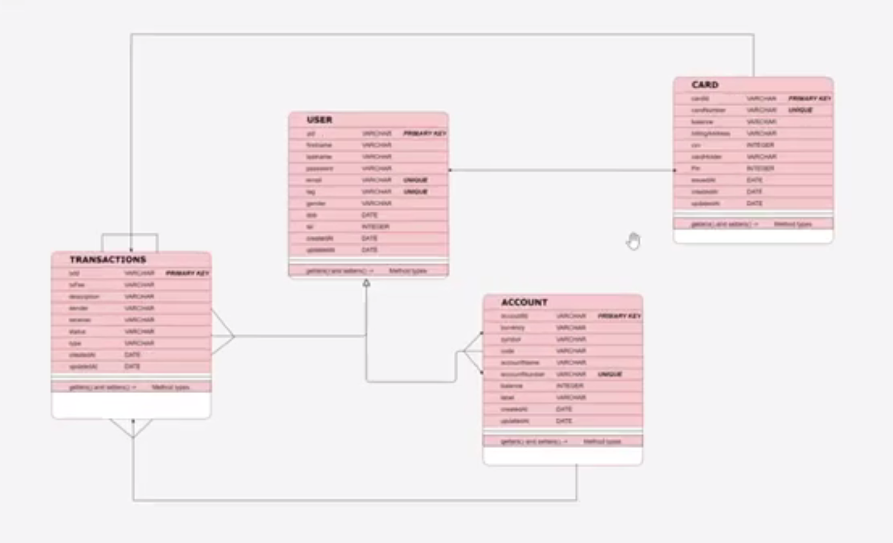

# **Introduction**

### **Explanation of the frontend -> 00:02:20**

1. Accounts Page
2. Transactions Page
3. Card Page
4. Convert Menu

# **Start Project**

### **Project**

The project is bootstrapped using the `start.spring.io` website.

### **Video Timestamp**

1. Bootstrapping the project -> 00:04:20

# **Data Access**

### Video Timestamp

1. ERD Diagram -> 00:09:50
2. (Start Implementation)* -> 00:12:40
3. JPA Buddy & Tabnine -> 00:12:40
4. Entities -> 00:17:20
    + User
    + Card
    + Transactions -> 00:32:50
    + Status (Enum)
    + Type (Enum)
    + Account -> 00:45:15
5. Application Properties -> 00:58:00
6. Repository Interface -> 01:07:30
    + UserRepository ->
    + AccountRepository ->

01:13:45

### **1. ERD Diagram is done. As seen shown below**



### **2. Tabnine and JPA Buddy**

#### **Tabnine**

Tabnine is an AI-powered coding assistant that helps you write code faster.

It autocompletes lines of code, suggests entire functions, learns from your coding style, etc.

It works with Java, Python, JavaScript, etc. Tabnine plugins are available for IDEs like VS Code, IntelliJ.

#### **JPA Buddy**

JPA Buddy is a developer tool (plugin) for working with databases in Java (especially Spring Boot).

It generates JPA entities (Java classes for database tables). It also helps manage relationships (OneToMany, etc.), and creates database schemas and migrations.

In simple terms, it helps you connect your Java code to your database easily.

### **Entities**

#### **`User`**

```java

```

Note: To be done. I have not put the `@UpdatedTimestamp` and `@CreationTimestamp` from Hibernate.

#### **`Card`**

```java

```

The `owner_id` in the `Card` entity class will be the name of the column that will be created for the foreign key.

Note: To be done. I have not put the `@UpdatedTimestamp` and `@CreationTimestamp` from Hibernate.

#### **`Transactions`**

```java

```

##### **`Status`**

```java

```

##### **`Type`**

```java

```

Using the Hibernate `@OneToMany` annotation in the `Card` entity class, and also the Hibernate `@ManyToOne` and `@JoinColumn(name = "card_id")` annotations in the `Transaction` entity class , we create a relationship between the two entity classes.

A column named `card_id` will be created in the `Transaction` table. This is the foreign key that matches a particular transaction to its card.

We also create a relationship between the `User` and `Transaction` entity classes. The user has a one-to-many relationship with transaction. The `owner_id` that will be created in the `Transaction` table will serve as the foreign key that matches a particular transaction to its owner.

Note: To be done. I have not put the `@UpdatedTimestamp` and `@CreationTimestamp` from Hibernate.

#### **`Account`**

```java

```

Note: To be done. I have not put the `@UpdatedTimestamp` and `@CreationTimestamp` from Hibernate.

### **Application Properties**

```properties
spring.application.name=bank.swa

# Data Source Configuration
spring.datasource.url=${RDB_URL:jdbc:mysql://localhost:3306/bank_db}
spring.datasource.username=${RDB_USERNAME:root}
spring.datasource.password=${RDB_PASSWORD:@folaFi081099}

# Hibernate Configuration
spring.jpa.hibernate.ddl-auto=update
spring.jpa.show-sql=true

```

### **Repository Interfaces**

# **Card Management**

Here, we will see how the user can use the client to **create** and **fund** a card.

### Video Timestamp

1. Some sort of explanation -> 05:25:00
2. Some other implementation explanation (Card Operations) -> 05:32:45
    1. The implementation -> 05:37:50
        + Get Card: 05:48:20
    2. Creating a new card -> 05:43:35
        + Create Card: 05:50:10
    3. 05:45:40 -> Crediting and Debiting a card
        + 06:20:33
        + 06:08:29

**Requirements**: The system must allow:

1. The customer must be able to get a card
2. The customer must be able to create a card
3. The customer must be able to fund/credit card from the bank balance
4. The customer must be able to withdraw/debit from card
5. The customer must be able to delete card

### Requirement: The customer must be able to get a card

**Request**:

1. User that is to be authenticated

**Response**:

1. The card

**Sequence Diagrams**:

1. User submits a request to get a card
2. User controller receives the request
    1. User controller calls for (Authentication / Session authentication)
    2. User controller calls the card service.getCard(User) method
3. User service READ operations
    1. The User controller calls the card repository.getbyUserId(user.getId) method

### Requirement: The customer must be able to create a card

**Request**:

1. User that is to be authenticated
2. deposit amount

**Response**:

1. The retrieved card

**Sequence Diagrams**:

1. User submits a request to create a new card
2. User controller receives the request
    1. User controller calls for (Authentication / Session authentication)
    2. User controller calls the card service.createCard(amount, User) method
3. User service CREATE operations
    1. User service creates a card object

**Constraints**:

1. The amount must be greater than 2
2. A USD account must exist for the user.
3. Also, the account that exists must be able to perform the transaction, i.e., it can pay the amount

### Requirement: The customer must be able to credit/fund card from the bank balance

**Request**:

1. User that is to be authenticated
2. Funding amount

**Response**:

1. Transaction that is done

**Sequence Diagrams**:

1. User submits a request to fund/credit a card
2. User controller receives the request
    1. User controller calls for (Authentication / Session authentication)
    2. User controller calls the card service.creditCard(amount, User) method
3. Card service operations
    1.

### Requirement: The customer must be able to debit/withdraw from card

**Request**:

1. User that is to be authenticated
2. Withdrawal amount

**Response**:

1. Transaction that is done

**Sequence Diagrams**:

1. User submits a request to withdraw/debit a card
2. User controller receives the request
    1. User controller calls for (Authentication / Session authentication)
    2. User controller calls the card service.debitCard(amount, User) method
3. ...


### Utility methods:

Class RandomUtil()


## **Transaction Management**

Testing with Postman -> 06:26:40
Refactoring -> 06:53:15
Code documentation -> 06:59:20

## **Front-end**

1. Project continuation after bootstrap -> 00:06:30
2. 
